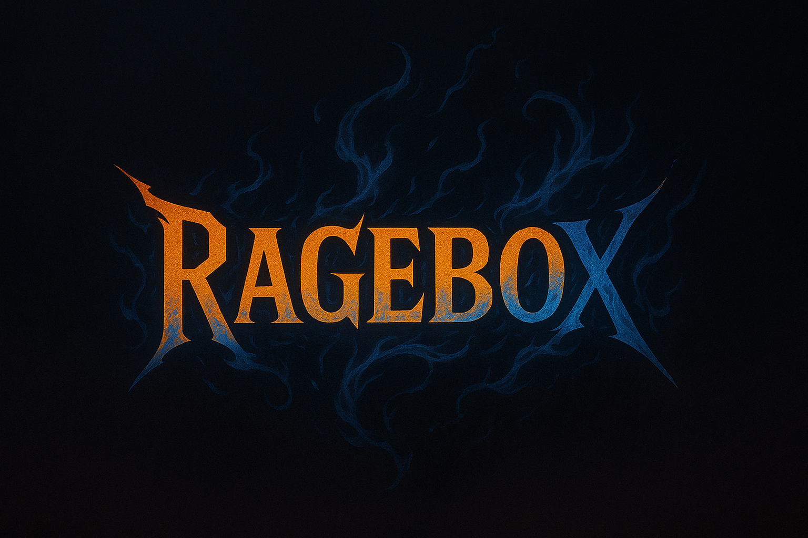

<p>
  
</p>

---

# RAGEBOX Music & Clip Manager

**RAGEBOX** is a local multimedia app for gym enthusiasts and athletes, created as a full-stack project by Benjamin Taylor & Julian Roberts.

It features advanced audio clip management, custom playlist creation, rage-level tagging, and a fully custom-built PyQt5 desktop interface. This project was designed to showcase full-stack software skills across GUI development, local database integration, media handling, and UX design.

## RAGEBOX Usage

To get started with RAGEBOX, you need to have access to the private repository. For security reasons, the source code is not publicly available. However, this `README.md` is public to showcase legitimacy and technical depth.

If you're a recruiter coming from LinkedIn and would like to verify the implementation, feel free to [DM me on LinkedIn](https://www.linkedin.com/in/btayl106). I’ll provide you with a `fine-grained personal access token` to review the source securely.


## Prerequisites

Make sure your local system is equipped with:

- [Python 3](https://www.python.org/downloads/)
- [pip](https://pip.pypa.io/en/stable/)
- [PyQt5](https://pypi.org/project/PyQt5/)
- [Mutagen](https://pypi.org/project/mutagen/)

You’ll also need basic familiarity with:

- Terminal / command line
- Python desktop app development


## Workflow Overview

This is the development workflow I follow when building out RAGEBOX.

### 1. Clip Upload & Metadata
- Upload or drag `.mp3`, `.wav`, or `.ogg` files
- Parse with Mutagen to extract duration
- Store metadata in a local SQLite database

### 2. Playlist Creation
- Create and name custom playlists
- Add, remove, and organize clips
- Upload custom thumbnails for playlists
- Save editable playlist descriptions

### 3. GUI Frontend
- PyQt5 interface with bounce-hover animated icons
- Sidebar navigation to playlists, liked songs, and uploads
- Grid view of all clips with rage level, title, and thumbnail

### 4. Media Controls
- Integrated play/pause, skip, shuffle, repeat
- Live rage level display on playbar
- Slider + time labels to track playback

### 5. Deployment
- Local desktop app
- Private GitHub repo w/ recruiter-facing access tokens


## Dev Setup Instructions

```bash
# Clone the repository
# (Requires GitHub access token)
git clone https://github.com/YOUR_USERNAME/ragebox.git
cd ragebox

# Set up virtualenv and install dependencies
python3 -m venv venv
source venv/Scripts/Activate
pip install -r requirements.txt

# Run the app
python main.py
```
Launches the RAGEBOX desktop window.


## Features

- 🎵 **High-performance audio playback**
- 🏋️ **Custom playlists** + thumbnail + description
- 🔥 **Rage level and emotion tagging system**
- 💻 **Grid-based PyQt5 interface with animations**
- 📸 **Clip thumbnails + advanced search and sort**
- 🧠 **Multi-select clip editing + drag-and-drop upload**
- 🌐 **Linked GitHub and LinkedIn profile buttons**
- 🔒 **Private GitHub repo access via token**


## Future Roadmap

- [ ] Export playlists to `.ragebox` shareable format
- [ ] Cloud-based sync and backup
- [ ] Visual rage-level meter with real-time feedback
- [ ] Wearable device integration for BPM-based auto-playlists
- [ ] Public website for app download and showcase


## Screenshots

### Main Dashboard
(coming soon)

### Playlist View
(coming soon)

### Clip Playbar
(coming soon)


## Contact

If you’re a recruiter or engineer interested in the code:
- 🔗 [DM me on LinkedIn](https://www.linkedin.com/in/btayl106)
- I’ll provide you with a personal access token to the private repo.

Thank you for checking out **RAGEBOX**, our full-stack, rage-fueled gym music & clip management project.
